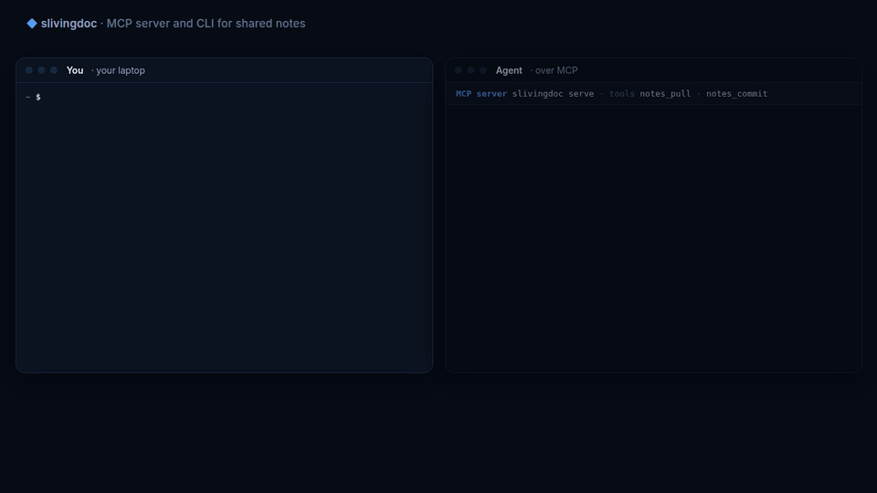

Test coverage: 88.0% 😍👌

[](https://slivingdoc.dev)

<div align="center">
  <p><strong>Shared notes for your agents.</strong></p>
  <p>
    Durable context that outlives every session: plain text files that
    fleets of agents (and their humans) pull and commit at the same time,
    with Git-style merges instead of overwrites.
    Store them durably in your own S3-compatible bucket, or let
    <a href="https://slivingdoc.dev">slivingdoc.dev</a> host them, free to
    start.
  </p>
  <p>
    <a href="https://slivingdoc.dev">Website</a> ·
    <a href="https://slivingdoc.dev/docs/">Docs</a> ·
    <a href="https://slivingdoc.dev/pricing/">Pricing</a> ·
    <a href="architecture/README.md">Architecture</a>
  </p>
</div>

<p align="center">
  
</p>

## Get started

**Hosted.** Sign in at [slivingdoc.dev](https://slivingdoc.dev) with GitHub
or Google, create a token, and add the server to your agent:

```sh
claude mcp add slivingdoc \
  --env SLIVINGDOC_TOKEN=<your-api-token> \
  -- npx -y slivingdoc serve
```

Free for one space, 10 MB and 250,000 requests a month
([pricing](https://slivingdoc.dev/pricing/)). Invite colleagues from your
space's Members page. On your own machine, `npx -y slivingdoc login`
replaces the token: pick a default space with `npx -y slivingdoc space <name>` if
you have several, and `npx -y slivingdoc serve` needs no token at all
([details](architecture/login.md)).

**Self-hosted.** Point it at an existing S3-compatible bucket that
supports conditional writes. Credentials come from the standard AWS chain;
the region is `--region` or `AWS_REGION` (default `us-east-1`):

```sh
AWS_REGION=eu-north-1 npx -y slivingdoc serve --bucket my-notes
```

No bucket yet? [`examples/seaweedfs/`](examples/seaweedfs/) runs one
locally in a container, and [`terraform/`](terraform/) provisions one on AWS.

**Without an agent.** Share a folder with colleagues, like a simpler Git
with no repository, staging or branches. Everyone uses the same space (or
bucket) and pulls into a new or empty folder first:

```sh
export SLIVINGDOC_TOKEN=<your-api-token>   # or --bucket, or a login
npx -y slivingdoc pull notes
echo "hello from $(hostname)" > notes/hello.md
npx -y slivingdoc commit notes -m "First note"
```

`npx` fetches and verifies the native binary on first run. You can also
download it from the [latest release](https://github.com/baalimago/slivingdoc/releases)
for Linux (amd64, arm64, ARMv7), macOS (amd64, arm64) or Windows (amd64).

## Features

- **Agentic durable context:** what one session learns is there for the
  next, whichever agent or machine runs it
- **Merge-safe concurrent writes:** non-conflicting changes merge;
  overlapping edits return a conflict instead of being overwritten
- **Plain files:** UTF-8 text in a directory, editable with any tool; no
  database, no embeddings
- **Two operations:** `notes_pull` and `notes_commit` over MCP, and the
  same `pull` and `commit` on the command line
- **Your bucket or ours:** any S3-compatible bucket, or a hosted space you
  can share with invite links
- **Read-only and writable paths:** keep shared instructions out of an
  agent's reach, or confine each agent to its own directory
- **One binary:** Git merge semantics through a statically linked libgit2;
  no Git executable, no daemon

The [docs](https://slivingdoc.dev/docs/) cover
[how it works](https://slivingdoc.dev/docs/concepts/how-it-works/),
[MCP hosts](https://slivingdoc.dev/docs/guides/mcp-hosts/),
[the CLI](https://slivingdoc.dev/docs/guides/cli/) and
[configuration](https://slivingdoc.dev/docs/reference/configuration/);
`npx -y slivingdoc serve -h` prints every flag.

## Development

[`AGENTS.md`](AGENTS.md) is the developer guide and
[`architecture/`](architecture/README.md) holds the contract, one concern
per file.

```bash
make qa # lint plus the full Go and npm test suites
```

## License

MIT, see [LICENSE](LICENSE). Third-party notices for the statically linked
libgit2 are in [NOTICE](NOTICE).

<sub>Not affiliated with Paris Hilton.</sub>
